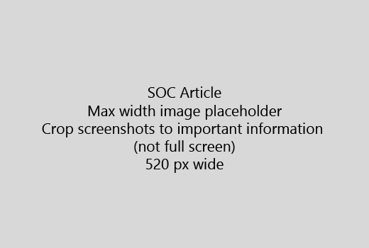

Twój artykuł rozpoczynać się bardzo krótkie wprowadzenie (1 zdanie). Postawić się w miejscu czytelnika - dlaczego są one w tym miejscu? Co należy zrobić? 
  
1. Od razu do szybkiego listę czynności do wykonania tego zadania.
    
    Jeśli trzeba wyjaśnić pojęcie lub musisz zrobić wstępnie wymaganych czynności, należy dodać krótkie podsumowanie poniżej kroku, gdzie konieczne, a także [łącza](https://support.office.com/article/f37e7984-cf03-4fde-92d3-82970d7e241b.aspx) do koncepcji lub kroki. 
    
2. Zachowaj procedur krótko - kroki najlepiej 5 lub mniej, nie więcej niż 8.
    
3. Użyj **stylu interfejsu użytkownika** dla elementów interfejsu użytkownika lub dla tekstu trzeba wprowadzić osób. 
    
4. Użyj zleceń wybierz, wybierz, lub wprowadzić jako akcje i sformatować menu jako **Menu** \> **polecenia**.
    
5. Opcjonalnie dodaj zrzut ekranu dla kontekstu (jeśli jest trudne do zlokalizowania interfejsu użytkownika, czy jest potrzebne do wykonania zadania).
    
    Maksymalna szerokość: 520 pikseli. Korzystanie z motywu standardowego, nie pokazuj żadnych danych osobowych i upraw, aby pokazać tylko to, co jest istotne. 
    
    
  
Jeśli chcesz dodać wideo lub zrzut ekranu, za pomocą dwóch kolumn siatki i czynności po lewej stronie i plików wideo lub zrzut ekranu w prawo - zobacz [przykład siatki wideo i kroki](https://support.office.com/article/14ce8e82-efa0-47f5-bb84-94f078db3dae.aspx). 
  
Docelowe nie więcej niż 500 wyrazów w artykule.
  
# Przykład artykułu

[Zmiana Moje zdjęcia](https://support.office.com/article/555376e0-1fca-49ba-8434-307a0525c767.aspx)
  

