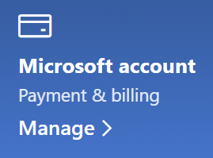

# Zmienianie informacji o koncie MicrosoftChange my Microsoft account information

Przejdź do [https://account.microsoft.com](https://account.microsoft.com/) odpowiedniego konta i zaloguj się w razie potrzeby.Go to [https://account.microsoft.com](https://account.microsoft.com/) and sign in if necessary. Spowoduje to, że przejdę do pulpitu nawigacyjnego konta.This will take you to your account dashboard.  

**Edytuj swoje imię i nazwisko oraz informacje osobiste****Edit my name and personal information**

1. Na pulpicie nawigacyjnym konta obok zdjęcia i nazwy konta kliknij pozycję Więcej akcji > **Edytuj profil**.On your account dashboard, next to your account picture and name, click **More actions > Edit profile**.
2. Na stronie **Edytowanie profilu** użyj podanych linków, aby zmienić swój obraz profilu, imię i nazwisko, datę urodzenia, lokalizację i preferencje języka wyświetlania.On the **Edit profile** page, use the links provided to change your profile picture, name, date of birth, location, and display language preference. Zwróć uwagę na linki do profilów swoich kont Xbox lub Skype, gdzie możesz zmienić szczegółowe informacje dotyczące tych kont.Note the links to your Xbox or Skype account profiles, where you can change details specific to these accounts.

**Zarządzanie adresami e-mail i numerami telefonów****Manage e-mail addresses and phone numbers**

Konto Microsoft ma co najmniej jeden adres e-mail lub numer telefonu skojarzony z kontem jako "aliasy".A Microsoft account has one or more e-mail addresses or phone numbers associated with it as “aliases.” Aby nimi zarządzać:To manage these:

1. Na pulpicie nawigacyjnym konta obok zdjęcia i nazwy konta kliknij pozycję Więcej akcji > **Edytuj profil**.On your account dashboard, next to your account picture and name, click **More actions > Edit profile**.
2. Na stronie **Edytowanie profilu** kliknij pozycję **Zarządzaj logowaniem do firmy Microsoft**.On the **Edit profile** page, click **Manage how you sign in to Microsoft**. 
3. Zostanie wyświetlona lista aliasów kont i będzie można zarządzać listą, łącznie z dodawaniem i usuwaniem adresów e-mail i numerów telefonów.You will see a list of account aliases, and you can manage the list, including adding and deleting e-mail addresses and phone numbers. W tym miejscu możesz również wybrać aliasy, których można używać do logowania się na koncie, a które są traktowane jako "podstawowe", które będą wyświetlane na urządzeniach z systemem Windows 10.Here you can also select which aliases can be used to sign in to the account, and which alias is considered “primary,” which will be displayed on your Windows 10 devices.

**Zarządzanie metodami płatności oraz nazwiskiem i adresem do rozliczeń****Manage payment methods, as well as name and address for billing** 

1. Na pulpicie nawigacyjnym konta obok zdjęcia i nazwy konta kliknij pozycję Więcej akcji > **Edytuj profil**.On your account dashboard, next to your account picture and name, click **More actions > Edit profile**.
2. W **obszarze & dla rozliczeń kliknij** pozycję **Zarządzaj**.Under **Payment & billing** click **Manage**.

    

3. Tutaj możesz dodawać, edytować i usuwać metody płatności i skojarzone z nimi adresy rozliczeniowe.Here you can add, edit, and remove payment methods and their associated billing addresses. 
