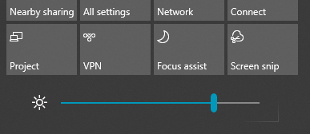

# Zmienianie jasności ekranu w systemie Windows 10Change screen brightness in Windows 10

Jeśli Twój system Windows 10 jest nowsza niż wersja 1903, zawiera suwak **Jasność** w centrum akcji.If your Windows 10 is newer than version 1903, it has a **Brightness slider** in the action center. Aby otworzyć centrum akcji,  kliknij przycisk Powiadomienie po prawej stronie paska zadań lub naciśnij na klawiaturze klawisze **Windows Home + A.**To open the action center, click the **Notification** button at the rightmost side of your taskbar, or press **Windows home + A** on your keyboard.

Jeśli system Windows 10 jest wcześniejszą wersją, suwak jasności można znaleźć, przechodząc do okna Ustawienia **[> System > Wyświetlacz.](ms-settings:display?activationSource=GetHelp)**If your Windows 10 is an earlier version, you can find the brightness slider by going to **[Settings > System > Display](ms-settings:display?activationSource=GetHelp)**.

**Uwagi:****Notes**:

- Być może nie widzisz suwaka Zmień jasność wbudowanego suwaka wyświetlania na komputerach stacjonarnych z monitorem zewnętrznym.You might not see the Change brightness for the built-in display slider on desktop PCs that have an external monitor. Aby zmienić jasność monitora zewnętrznego, użyj kontrolek monitora.To change the brightness of an external monitor, use the controls on the monitor.
- Jeśli nie masz komputera stacjonarnego i suwak nie jest widoczny lub nie działa, spróbuj zaktualizować sterownik ekranu.If you don't have a desktop PC and the slider doesn't appear or work, try updating the display driver. W polu wyszukiwania na pasku zadań wpisz **Menedżer**  urządzeń , a następnie wybierz z listy wyników pozycję Menedżer urządzeń.In the search box on the taskbar, type **Device Manager**, and then select **Device Manager** from the list of results. W **Menedżerze urządzeń** wybierz **kartę graficzną**, a następnie wybierz kartę graficzną.In **Device Manager**, select **Display adapters**, then select the display adapter. Naciśnij i przytrzymaj (lub kliknij prawym przyciskiem myszy) nazwę karty wideo, a następnie kliknij pozycję **Aktualizuj sterownik**; a następnie postępuj zgodnie z instrukcjami.Press and hold (or right-click) the display adapter name and click **Update driver**; then follow the instructions.
