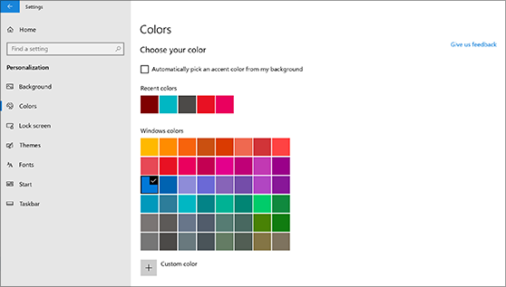
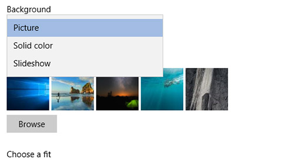

# Zmienianie tła i kolorów pulpituChange your desktop background and colors

Aby zmienić ustawienie kolorów, przejdź do **menu Start**  >  **Ustawienia**,  >  **Personalization**  >  **Colors**a następnie wybierz własny kolor lub Zezwól systemowi Windows na ściąganie koloru akcentu z tła.To change your colors setting, go to **Start** > **Settings** > **Personalization** > **Colors**, and then choose your own color or let Windows pull an accent color from your background.

Aby zmienić tło pulpitu, **Przejdź do**  >  **Settings**  >  **tła personalizacji**ustawień  >  **Background**, a następnie wybierz obraz, pełny kolor lub Utwórz pokaz slajdów dla obrazów.To change your desktop background, go to **Start** > **Settings** > **Personalization** > **Background**, and then choose a picture, solid color, or create a slideshow of pictures. 

Chcesz więcej tła i kolorów pulpitu?Want more desktop backgrounds and colors? Odwiedź [sklep Microsoft Store](https://www.microsoft.com/store/collections/windowsthemes) , aby wybrać z dziesiątek bezpłatnych motywów.Visit [Microsoft Store](https://www.microsoft.com/store/collections/windowsthemes) to choose from dozens of free themes.
