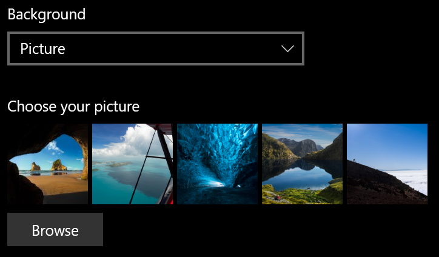
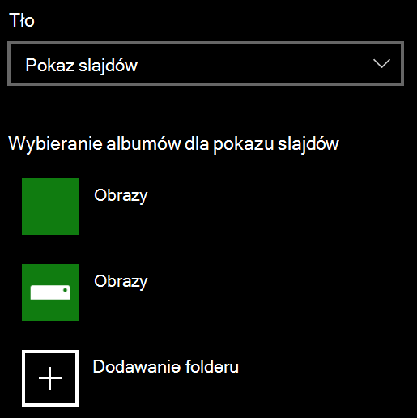

# Zmienianie tła ekranu blokady

- Przejdź do **ekranu**  >  **blokady**  >  **Personalizacja Ustawień.** Możesz też kliknąć lub nacisnąć [tutaj](ms-settings:lockscreen?activationSource=GetHelp).

- Aby ustawić niestandardowy obraz tła,  wybierz pozycję **Obraz** z listy rozwijanej Tło i wybierz pozycję **lub Przejdź** do obrazu.

  

- Aby skonfigurować pokaz slajdów z obrazami  niestandardowymi, wybierz pozycję Pokaz **slajdów** z listy rozwijanej Tło i wybierz album lub dodaj folder zawierający obrazy z pokazu slajdów.

  
