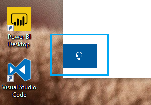

# Skontaktuj się z nami, klikając przycisk słuchawek

Jeśli chcesz skontaktować się z pomocą  techniczną firmy Microsoft, kliknij pozycję Skontaktuj się z nami w lewym dolnym rogu tej aplikacji. W oknie wysuwany zostanie przewodnik do odpowiedniego kanału pomocy technicznej po wybraniu odpowiedniego produktu i kategorii problemu.

Możesz nadal wchodzić w interakcje z pozostałą aplikacją nawet po zainicjowaniu sesji Kontakt z nami. Panel Kontakt z nami można tymczasowo zminimalizować, klikając dowolne inne miejsce w aplikacji. Aby wrócić do tej samej sesji, po prostu kliknij pozycję **Skontaktuj się z nami** ponownie.
