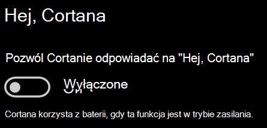

# Cortana nie rozmawia ze mną lub mnie nie słyszy

Jeśli próbujesz skorzystać z funkcji "Hey Cortana", która umożliwia rozmowę z Cortaną bez wybierania przycisku Cortana na pasku zadań lub przycisku mikrofonu w panelu Cortana, potwierdź, że funkcja jest włączona:

1. Przejdź do **ekranu startowego**, a następnie wybierz **[pozycję Ustawienia > Cortanie](ms-settings:cortana?activationSource=GetHelp)**.
2. W **obszarze Hey Cortana**przełącz przełącznik **"Hey Cortana" na** **On**.

**Czy ustawienia prywatności uniemożliwiają Cortanie słyszenie?**

Ustawienia prywatności mogą uniemożliwić Cortanie odpowiadanie na Twój głos.
- Sprawdź, czy rozpoznawanie mowy online jest włączone:
    - Przejdź do **ekranu startowego,** a następnie kliknij pozycję **[Ustawienia > Prywatność > mowa](ms-settings:privacy-speech?activationSource=GetHelp)**.
    - W obszarze **Rozpoznawanie mowy online**przełącz ustawienie **Na wł.**
- Upewnij się, że Cortana ma uprawnienia dostępu do mikrofonu. 
    - Przejdź do ekranu startowego, a następnie kliknij pozycję **[Ustawienia > mikrofon > prywatności](ms-settings:privacy-microphone?activationSource=GetHelp)**.
    - W **obszarze Wybierz aplikacje, które mogą uzyskać dostęp do mikrofonu**, poszukaj **Cortany** na liście aplikacji i usług i upewnij się, że przełącznik jest włączony **.**

Co więcej, upewnij się również, że głośniki lub mikrofony są w górze i działają, aby porozmawiać z Cortaną.
