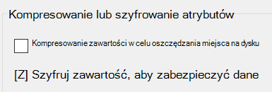

# Szyfrowanie plików lub folderów w systemie Windows 10Encrypt files or folder in Windows 10

Możesz zaszyfrować cały dysk przy użyciu funkcji BitLocker, ale w celu zaszyfrowania tylko pojedynczych plików lub folderów (i ich zawartości):You can encrypt an entire disk using BitLocker, but to encrypt only individual files or folders (and their contents):

1. W **Eksploratorze** plików wybierz pliki/foldery, które chcesz zaszyfrować.In **File Explorer**, select the file(s)/folder(s) you want to encrypt. W tym przykładzie wybrano dwa pliki:In this example, two files have been selected:

    

2. Kliknij prawym przyciskiem myszy zaznaczone pliki i kliknij polecenie **Właściwości**.Right-click the selected files and click **Properties**.

3. W **oknie Właściwości** kliknij pozycję **Zaawansowane**.In the **Properties** window, click **Advanced**.

4. W **oknie Właściwości zaawansowane** zaznacz pole wyboru **Szyfruj zawartość, aby zabezpieczyć** dane:In the **Advanced Properties** window, select the **Encrypt contents to secure data** checkbox:

    

5. Kliknij przycisk **OK**.Click **OK**.
