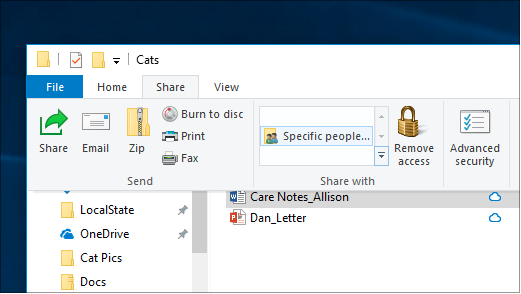
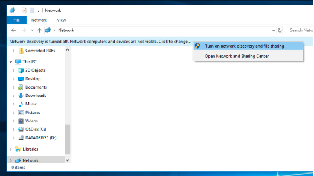

# Udostępnianie plików przez sieć w systemie Windows 10File sharing over a network in Windows 10

**Uwaga:** Jeśli wcześniej używano grupy domowej do udostępniania plików, należy pamiętać, że grupa domowa została usunięta z systemu Windows 10 (wersja 1803).**Note**: If you previously used HomeGroup for file sharing, please note that HomeGroup has been removed from Windows 10 (Version 1803). Drukarki i pliki można teraz udostępniać przy użyciu wbudowanych funkcji systemu Windows 10.You can now share printers and files by using built-in features in Windows 10.

**Aby udostępnić pliki lub foldery za sprawą sieci****To share files or folders over a network**

- W **Eksploratorze plików**wybierz plik > kliknij kartę **Udostępnij** u góry > w sekcji **Udostępnij,** kliknij pozycję **Określone osoby**.In **File Explorer**, select a file > click the **Share** tab at the top > in the **Share with** section, click **Specific people**.

    
          
- Jeśli wybierzesz wiele plików jednocześnie, możesz udostępnić je wszystkie w ten sam sposób.If you select multiple files at once, you can share them all in the same way. To działa również dla folderów.It works for folders, too.

**Aby wyświetlić urządzenia w sieci, które udostępniają pliki****To see devices on the network that are sharing files**

- W **Eksploratorze plików**przejdź do **sieci**.In **File Explorer**, go to **Network**. Jeśli odnajdowanie sieci nie jest włączone, zostanie wyświetlony komunikat o błędzie "Odnajdowanie sieci jest wyłączone..."If Network discovery is not enabled, you will see an error message "Network discovery is turned off..."

- Kliknij **baner Odnajdowanie sieci** jest wyłączony, a następnie kliknij **pozycję Włącz odnajdowanie sieci i udostępnianie plików**.Click the **Network discovery is turned off** banner, then click **Turn on network discovery and file sharing**.

    

[Dowiedz się więcej o udostępnianiu plików w sieciRead more about file sharing over a network](https://support.microsoft.com/help/4092694/windows-10-file-sharing-over-a-network)

[Udostępnianie plików za pomocą aplikacji, usługi OneDrive, wiadomości e-mail i innychShare files using apps, OneDrive, emails, and more](https://support.microsoft.com/help/4027674/windows-10-share-files-in-file-explorer)
