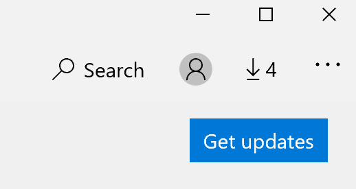

# Naprawianie języka wyświetlania aplikacjiFix the display language of apps

Po zmianie języka wyświetlania w systemie Windows 10 niektóre aplikacje mogą nadal używać poprzedniego języka po ich otwarciu.After you change the display language in Windows 10, some apps may still use the previous language when you open them. Dzieje się tak, ponieważ nowe wersje aplikacji dla tego języka muszą zostać pobrane ze Sklepu.This happens because new versions of the apps for that language must be downloaded from the Store. Aby rozwiązać ten problem, możesz poczekać na aktualizację automatyczną lub ręcznie zainstalować zaktualizowaną wersję aplikacji.To fix this problem, you can either wait for the automatic update, or you can manually install the updated version of the apps.

Aby ręcznie zainstalować aktualizację, otwórz **sklep Microsoft Store** i kliknij pozycję **Pobrane i aktualizacje** w prawym górnym rogu.To manually install the update, open **Microsoft Store** and click **Downloads and updates** in the top right corner. Następnie kliknij **pozycję Pobierz aktualizacje**.Then click **Get updates**. Jeśli język nie zostanie zmieniony po zakończeniu aktualizacji, spróbuj ponownie uruchomić komputer.If the language is not changed after the update is complete, try restarting your PC.

Aby dowiedzieć się więcej o ustawieniach języka wprowadzania i wyświetlania, zobacz [Zarządzanie ustawieniami języka wprowadzania i wyświetlania w systemie Windows 10](https://support.microsoft.com/help/4027670/windows-10-add-and-switch-input-and-display-language-preferences).To read more about input and display language settings, see [Manage your input and display language settings in Windows 10](https://support.microsoft.com/help/4027670/windows-10-add-and-switch-input-and-display-language-preferences).
