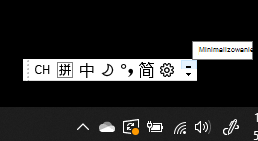
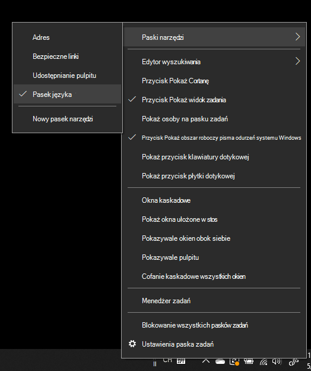
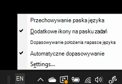

# Ukrywanie, wyświetlanie lub resetowanie paska językaHide, display, or reset the language bar

**Aby zminimalizować pasek języka:****To minimize the language bar:**

Możesz kliknąć przycisk minimalizuj w prawym górnym rogu paska języka.You can click the minimize button on the top right corner of the language bar. Możesz też po prostu przeciągnąć pasek języka na pasek zadań, co spowoduje automatyczne zminimalizowanie tego paska.Or, you can just drag the language bar to the task bar, which will automatically minimize it.

**Aby wyjść z paska języka:****To pop out the language bar:**

Jeśli nie chcesz zadokować paska języka na pasku zadań, kliknij prawym przyciskiem myszy dowolne  puste miejsce na pasku zadań i wyczyść zaznaczenie opcji Pasek języka w menu Paski narzędzi.If you don't want to dock the language bar in the taskbar, right-click any empty space in the taskbar, and uncheck the **Language bar** option in the Toolbars menu. Pasek języka pojawi się poza obszarem paska zadań, tak jak na poprzednim zrzucie ekranu.This will make the language bar appear outside the taskbar, just like the previous screenshot.

**Aby przywrócić domyślny pasek języka:****To restore the language bar to default:**

Kliknij prawym przyciskiem myszy przycisk języka na pasku narzędzi, a następnie kliknij polecenie Przywróć **opcję** paska języka w menu.Right-click the language button in the toolbar, and click **Restore the language bar** option in the menu. Spowoduje to przywrócenie domyślnego ustawienia.This will restore it to default.

