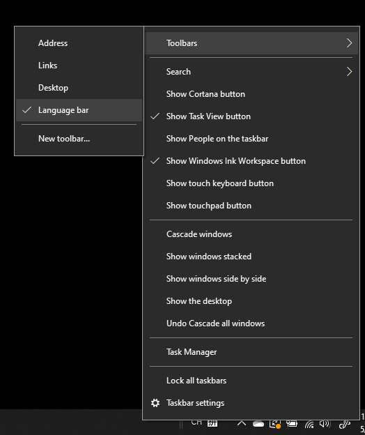

# Ukrywanie, wyświetlanie lub resetowanie paska języka

**Aby zminimalizować pasek języka:**

Możesz kliknąć przycisk minimalizuj w prawym górnym rogu paska języka. Możesz też po prostu przeciągnąć pasek języka na pasek zadań, co spowoduje automatyczne zminimalizowanie tego paska.

**Aby wyjść z paska języka:**

Jeśli nie chcesz zadokować paska języka na pasku zadań, kliknij prawym przyciskiem myszy dowolne  puste miejsce na pasku zadań i wyczyść zaznaczenie opcji Pasek języka w menu Paski narzędzi. Pasek języka pojawi się poza obszarem paska zadań, tak jak na poprzednim zrzucie ekranu.

**Aby przywrócić domyślny pasek języka:**

Kliknij prawym przyciskiem myszy przycisk języka na pasku narzędzi, a następnie kliknij polecenie Przywróć **opcję** paska języka w menu. Spowoduje to przywrócenie domyślnego ustawienia.

