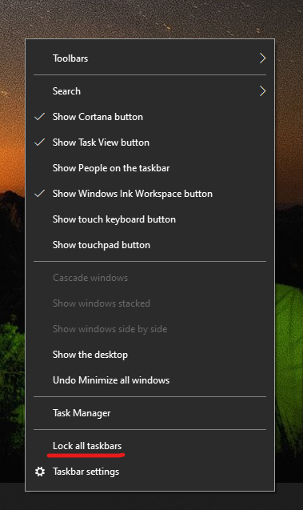

# Przenoszenie paska zadań na bok lub do górnej części pulpituMove the taskbar to either side or the top of your desktop

Najpierw upewnij się, że pasek zadań jest odblokowany.First, please confirm that the taskbar is unlocked. Aby dowiedzieć się, czy Twoje zadanie jest odblokowane, kliknij prawym  przyciskiem myszy dowolne puste miejsce na pasku zadań i sprawdź, czy obok przycisku Zablokuj pasek zadań znajduje się znacznik wyboru.To find out whether yours is unlocked, right-click any empty space on the taskbar and see whether **Lock the taskbar** has a checkmark next to it. Jeśli jest znacznik wyboru, pasek zadań jest zablokowany i nie można go przenieść.If there is a checkmark, the taskbar is locked and cannot be moved. Kliknięcie **przycisku Zablokuj pasek zadań** raz spowoduje jego odblokowanie i usunięcie znacznika wyboru.Clicking **Lock the taskbar** once will unlock it and remove the checkmark.

Jeśli masz wiele monitorów, na których jest wyświetlany pasek zadań, zobaczysz komunikat Zablokuj **wszystkie paska zadań.**If you have multiple monitors that display the taskbar, you will see **Lock all taskbars**.

Po odblokowaniu paska zadań możesz nacisnąć i przytrzymać dowolne puste miejsce na pasku zadań, a następnie przeciągnąć je w dowolne miejsce na ekranie.Once the taskbar is unlocked, you can press and hold any empty space on the taskbar and drag it to the location you want on the screen. Możesz to również zrobić, klikając prawym przyciskiem myszy dowolne puste miejsce na pasku zadań i przejdź do pozycji Ustawienia paska zadań > ** lokalizacji paska zadań na ekranie**.You can also do so by right-clicking on any empty space on the taskbar and go to **[Taskbar settings](ms-settings:taskbar?activationSource=GetHelp) > Taskbar location on screen**.
