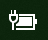

# W systemie Windows 10 brakuje ikony zasilania lub baterii

Jeśli Twoje urządzenie z systemem Windows 10 ma baterię (np. laptop lub tablet albo komputer podłączony przez USB do zasilacza awaryjnego), zwykle ikona zasilania/baterii jest wyświetlana na pasku zadań obok zegara, na przykład:

Jeśli ta ikona nie jest wyświetlana, może być ukryta:

1. Przejdź do pozycji **[Ustawienia > Personalizacji > Pasek zadań](ms-settings:taskbar?activationSource=GetHelp)**.

2. W obszarze powiadomień kliknij pozycję **Wybierz ikony, które będą wyświetlane na pasku zadań**.

3. Następnie znajdź na liście element **Zasilanie** i przełącz jego ustawienie na wartość **Wł.**.

    

**Rozwiązywanie problemów**

Jeśli po wykonaniu powyższych instrukcji przełącznik **Zasilanie** jest wyszarzony lub niewidoczny, w polu wyszukiwania na pasku zadań wpisz **menedżer urządzeń**, a następnie na liście wyników wybierz pozycję **Menedżer urządzeń**. W obszarze **Baterie** kliknij prawym przyciskiem myszy baterię urządzenia, kliknij pozycję **Wyłącz**, a następnie kliknij pozycję **Tak**. Poczekaj kilka sekund, a następnie kliknij prawym przyciskiem myszy baterię i kliknij pozycję **Włącz**. Następnie ponownie uruchom urządzenie.

Jeśli po wykonaniu powyższych instrukcji ikona baterii nie jest wyświetlana na pasku zadań, w polu wyszukiwania na pasku zadań wpisz **menedżer zadań**, a następnie na liście wyników kliknij pozycję **Menedżer zadań**. Na karcie **Procesy** w obszarze **Nazwa** kliknij prawym przyciskiem myszy pozycję **Eksplorator**, a następnie kliknij pozycję **Uruchom ponownie**.
