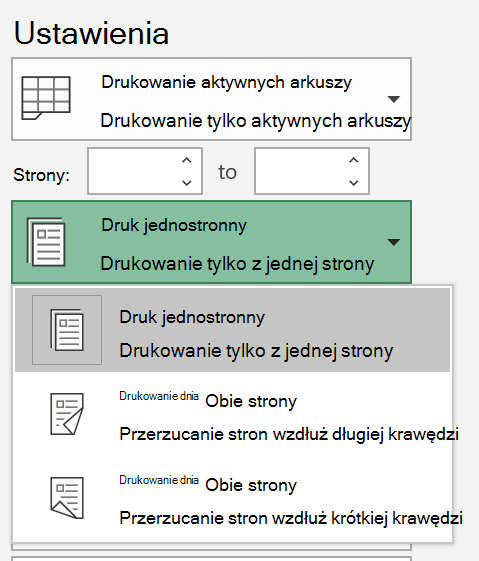
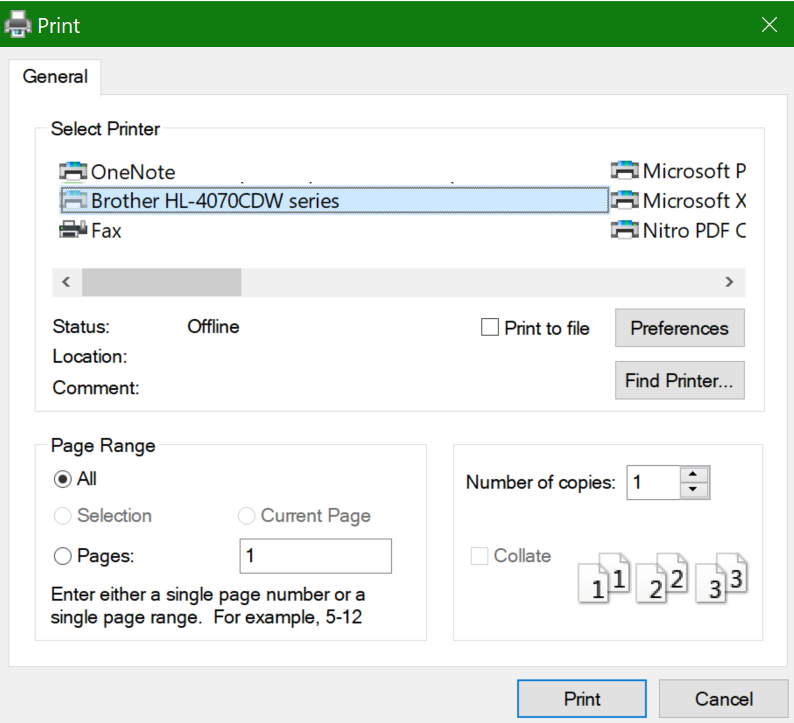

# Drukowanie na obu stronach papieru (drukowanie dwustronne)

**Czy moja drukarka obsługuje drukowanie dwustronne?**

W podsumowaniu funkcji drukarki lub w instrukcji ręcznej należy sprawdzić, czy może ona drukować na obu stronach papieru, co jest nazywane również "drukowaniem dwustronnym". Jeśli masz pakiet Microsoft Office, możesz to sprawdzić, otwierając aplikację pakietu Office, taką jak Word lub Excel, przechodząc do menu Plik **> Print,** upewniąc się, że wybrana jest właściwa drukarka, i poszukaj odpowiedniej funkcji w sekcji Ustawienia. Przykład: 

**Drukowanie dwustronne w psłudze Microsoft Office**

Jeśli drukarka umożliwia drukowanie na obu stronach, po przejdź do menu Plik **>** Drukuj w aplikacji pakietu Office, zobaczysz opcję "Druk po obu stronach", jak pokazano w powyższym przykładzie.  Wybierz typ drukowania dwustronnego (przerzuć długą krawędź lub krótką  krawędź) i kliknij przycisk Drukuj, aby rozpocząć drukowanie.

**Drukowanie dwustronne z dowolnej aplikacji**

W wielu aplikacjach podczas drukowania zobaczysz ogólne okno dialogowe drukowania, które wygląda następująco: 

Upewnij się, że jest wybrana właściwa drukarka, a następnie kliknij pozycję **Preferencje,** aby otworzyć okno preferencji drukarki. Jeśli drukarka umożliwia drukowanie dwustronne, w tym oknie będzie można włączyć tę opcję dla bieżącego zadania drukowania.
