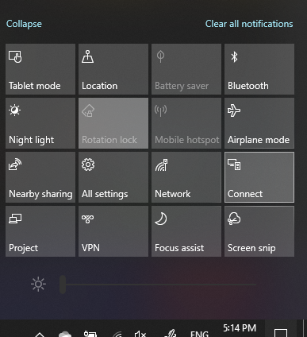

# Program Project na komputerze PCProject to a PC

Na urządzeniu docelowym (program Project to) Wyszukaj "Ustawienia projekcji", aby otworzyć stronę Ustawienia programu **Project na tym komputerze**.On your destination device (projecting to), search for "Projection Settings" to open the Settings page of **Projecting to this PC**. Następnie upewnij się, że:Then make sure that:
- "Niektóre urządzenia z systemem Windows i Android umożliwiają programowi Project na tym komputerze, gdy jest to możliwe, w menu rozwijanym jest ustawiona wartość **zawsze wyłączone**."Some Windows and Android devices can project to this PC when you say it's OK" drop-down menu is set to **Always Off**.
- Menu rozwijane "Poproś o program Project do tego komputera" jest ustawiane za **każdym razem, gdy jest wymagane połączenie**."Ask to project to this PC" drop-down menu is set to **Every time a connection is required**.
- Menu rozwijane "Wymagaj numeru PIN dla parowania" jest ustawione na wartość **nigdy**."Require PIN for pairing" drop-down menu is set to **Never**.

Na urządzeniu docelowym Uruchom aplikację **Connect** , aby **rozpocząć** i wyszukać "Connect".On your destination device, launch **Connect** app by going to **Start** and search for "Connect".

Następnie na urządzeniu źródłowym, z którego próbujesz wykonać projekt:Then, on your source device that you are trying to project from:

1. Naciśnij klawisze **Windows + A** , aby otworzyć Centrum akcji.Press **Windows key + A** to open Action Center.
2. Kliknij pozycję **Połącz**.Click **Connect**.
3. Kliknij urządzenie, na którym chcesz umieścić ekran.Click the device you want to project the screen to.

Po wykonaniu powyższych czynności urządzenie docelowe powinno wyświetlać ekran urządzenia źródłowego tak, jakby jest monitorem pomocniczym.After the above steps, your destination device should display the screen of the source device as if it is a secondary monitor.
