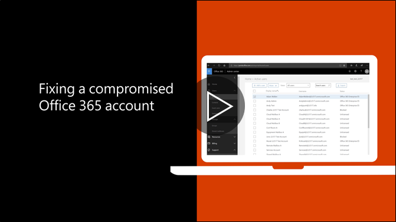

# Zalecane działania w przypadku złamania zabezpieczeń kontaRecommended steps to take if an account is compromised

  
1. Natychmiast [zresetować hasło użytkownika](https://support.office.com/article/7a5d073b-7fae-4aa5-8f96-9ecd041aba9c) . Nie przedstawią nowego hasła za pośrednictwem wiadomości e-mail do użytkownika końcowego.[Reset the user's password](https://support.office.com/article/7a5d073b-7fae-4aa5-8f96-9ecd041aba9c) immediately. Do not communicate the new password through email to the end user. 
    
2. Usuń wszelkie podejrzane [przekazywanie adresów](https://support.office.com/article/ab5eb117-0f22-4fa7-a662-3a6bdb0add74) należy ustawić na poziomie skrzynki pocztowej.Remove any suspicious [forwarding addresses](https://support.office.com/article/ab5eb117-0f22-4fa7-a662-3a6bdb0add74) set at the mailbox level. 
    
3. Usuń wszelkie podejrzane [reguł skrzynki odbiorczej](https://support.office.com/article/1433E3A0-7FB0-4999-B536-50E05CB67FED) ustawione w ramach skrzynki pocztowej.Remove any suspicious [inbox rules](https://support.office.com/article/1433E3A0-7FB0-4999-B536-50E05CB67FED) set within the mailbox. 
    
4. Jeśli użytkownik ma zablokowaną możliwość wysyłania wiadomości e-mail, [Przejdź do ograniczony dostęp, aby odblokować konto](https://protection.office.com/?hash=/restrictedusers). Gdy to zrobisz, użytkownik należy można wznowić wysyłanie wiadomości w ciągu 1 godziny.If the user is blocked from sending email, [go to the Restricted Users to unblock the account](https://protection.office.com/?hash=/restrictedusers). Once done, the user should be able to resume sending messages within 1 hour.
    
5. Usunąć konto użytkownika z wszystkich [grup roli administracyjnej](https://support.office.com/article/eac4d046-1afd-4f1a-85fc-8219c79e1504) , dopóki są pewni, że konto nie jest zagrożona.Remove the user account from any [administrative role groups](https://support.office.com/article/eac4d046-1afd-4f1a-85fc-8219c79e1504) until you are confident that the account is no longer compromised. 
    
W celu zminimalizowania ryzyka naruszenia danych lub zagrożone konta w przyszłości, firma Microsoft zaleca czytanie nasze [najlepsze rozwiązania dotyczące zabezpieczeń usługi Office 365](https://support.office.com/article/9295e396-e53d-49b9-ae9b-0b5828cdedc3).To minimize the potential of a data breach or a compromised account in the future, we recommend reading our [Office 365 Security best practices article](https://support.office.com/article/9295e396-e53d-49b9-ae9b-0b5828cdedc3).
  

