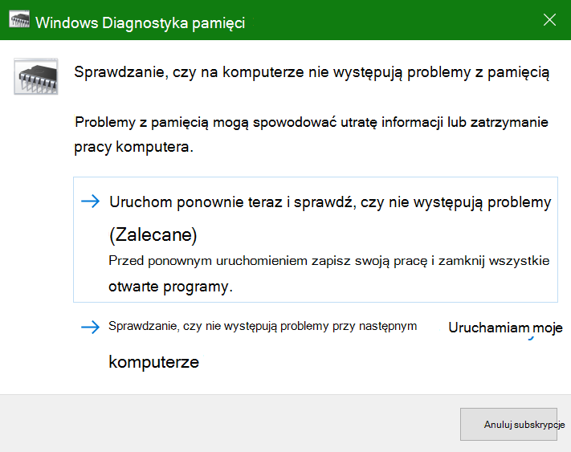
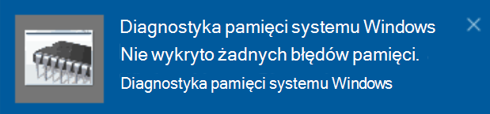

# Uruchamianie Diagnostyki pamięci systemu Windows w systemie Windows 10

Jeśli system Windows i aplikacje na komputerze ulega awarii, zawieszają się lub działają niestabilnie, może wystąpić problem z pamięcią RAM komputera. Możesz uruchomić Narzędzie Diagnostyka pamięci systemu Windows, aby sprawdzić, czy nie występują problemy z pamięcią RAM komputera.

W polu wyszukiwania na pasku zadań wpisz diagnostykę pamięci **,** a następnie wybierz pozycję **Diagnostyka pamięci systemu Windows**. 

Aby uruchomić diagnostykę, komputer musi zostać uruchomiony ponownie. Masz możliwość natychmiastowego ponownego uruchomienia (zapisz najpierw swoją pracę i zamknij otwarte dokumenty i wiadomości e-mail) lub zaplanuj automatyczne uruchamianie diagnostyczne przy następnym ponownym uruchomieniu komputera:

Po ponownym uruchomieniu komputera narzędzie **Diagnostyka pamięci** systemu Windows zostanie uruchomione automatycznie. Stan i postęp będą wyświetlane jako diagnostyka, a Ty możesz anulować diagnostykę, naciskając klawisz **ESC** na klawiaturze.

Po zakończeniu diagnostyki system Windows zacznie normalnie.
Natychmiast po ponownym uruchomieniu, gdy zostanie wyświetlony pulpit, zostanie wyświetlone powiadomienie (obok ikony Centrum akcji na pasku zadań) wskazujące, czy zostały znalezione błędy pamięci.  Przykład:

Oto ikona Centrum akcji:  

Oraz przykładowe powiadomienie: 

Jeśli przegapisz powiadomienie, możesz  wybrać ikonę Centrum akcji na  pasku zadań, aby wyświetlić Centrum akcji i wyświetlać przewijaną listę powiadomień.

Aby przejrzeć szczegółowe informacje, wpisz **zdarzenie** w polu wyszukiwania na pasku zadań, a następnie wybierz pozycję **Podgląd zdarzeń**. W **okienku podglądu** zdarzeń po lewej stronie przejdź do okna Dzienniki **systemu Windows > systemu**. W okienku po prawej stronie zeskanuj  listę w dół, patrząc na kolumnę Źródło, aż zobaczysz zdarzenia z wartością źródłową **MemoryDiagnostics-Results.** Wyróżnij każde takie zdarzenie i wyświetl informacje o wynikach w polu pod **kartą** Ogólne poniżej listy.
