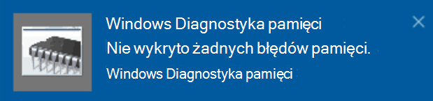

# Uruchamianie Diagnostyki pamięci systemu Windows w systemie Windows 10Run Windows Memory Diagnostics in Windows 10

Jeśli system Windows i aplikacje na komputerze ulega awarii, zawieszają się lub działają niestabilnie, może wystąpić problem z pamięcią RAM komputera.If Windows and apps on your PC are crashing, freezing, or acting in an unstable manner, you may have a problem with the PC’s memory (RAM). Możesz uruchomić Narzędzie Diagnostyka pamięci systemu Windows, aby sprawdzić, czy nie występują problemy z pamięcią RAM komputera.You can run the Windows Memory Diagnostic to check for problems with the PC’s RAM.

W polu wyszukiwania na pasku zadań wpisz diagnostykę pamięci **,** a następnie wybierz pozycję **Diagnostyka pamięci systemu Windows**.In the search box on your taskbar, type **memory diagnostic**, and then select **Windows Memory Diagnostic**. 

Aby uruchomić diagnostykę, komputer musi zostać uruchomiony ponownie.To run the diagnostic, the PC needs to restart. Masz możliwość natychmiastowego ponownego uruchomienia (zapisz najpierw swoją pracę i zamknij otwarte dokumenty i wiadomości e-mail) lub zaplanuj automatyczne uruchamianie diagnostyczne przy następnym ponownym uruchomieniu komputera:You have the option to restart immediately (please save your work and close open documents and e-mails first), or schedule the diagnostic to run automatically the next time the PC restarts:

Po ponownym uruchomieniu komputera narzędzie **Diagnostyka pamięci** systemu Windows zostanie uruchomione automatycznie.When the PC restarts, the **Windows Memory Diagnostics Tool** will run automatically. Stan i postęp będą wyświetlane jako diagnostyka, a Ty możesz anulować diagnostykę, naciskając klawisz **ESC** na klawiaturze.Status and progress will be displayed as the diagnostics run, and you have the option of cancelling the diagnostics by hitting the **ESC** key on your keyboard.

Po zakończeniu diagnostyki system Windows zacznie normalnie.When the diagnostics are complete, Windows will start normally.
Natychmiast po ponownym uruchomieniu, gdy zostanie wyświetlony pulpit, zostanie wyświetlone powiadomienie (obok ikony Centrum akcji na pasku zadań) wskazujące, czy zostały znalezione błędy pamięci. Immediately after restart, when the Desktop appears, a notification will appear (next to the **Action Center** icon on the taskbar), to indicate whether any memory errors were found. Przykład:For example:

Oto ikona Centrum akcji:Here's the Action Center icon:  

Oraz przykładowe powiadomienie:And a sample notification: 

Jeśli przegapisz powiadomienie, możesz  wybrać ikonę Centrum akcji na  pasku zadań, aby wyświetlić Centrum akcji i wyświetlać przewijaną listę powiadomień.If you missed the notification, you can select the **Action Center** icon  on the taskbar to display the **Action Center** and see a scrollable list of notifications.

Aby przejrzeć szczegółowe informacje, wpisz **zdarzenie** w polu wyszukiwania na pasku zadań, a następnie wybierz pozycję **Podgląd zdarzeń**.To review detailed information, type **event** into the search box on your taskbar, and then select **Event Viewer**. W **okienku podglądu** zdarzeń po lewej stronie przejdź do okna Dzienniki **systemu Windows > systemu**.In the **Event Viewer**’s left-hand pane, navigate to **Windows Logs > System**. W okienku po prawej stronie zeskanuj  listę w dół, patrząc na kolumnę Źródło, aż zobaczysz zdarzenia z wartością źródłową **MemoryDiagnostics-Results.**In the right-hand pane, scan down the list while looking at the **Source** column, until you see events with Source value **MemoryDiagnostics-Results**. Wyróżnij każde takie zdarzenie i wyświetl informacje o wynikach w polu pod **kartą** Ogólne poniżej listy.Highlight each such event and see the result information in the box under the **General** tab below the list.
