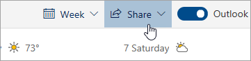

# Udostępnianie w aplikacji Outlook w sieci Web

1. U dołu strony wybierz pozycję Kalendarz, aby przejść do kalendarza.

2. W aplikacji Kalendarz na pasku narzędzi u góry strony wybierz pozycję **Udostępnij**i wybierz kalendarz, który chcesz udostępnić. 

    

    **Uwaga:** Nie można udostępniać kalendarzy należących do innych osób.

3. Wprowadź imię i nazwisko lub adres e-mail osoby, której kalendarz chcesz udostępnić.

4. Wybierz sposób, w jaki dana osoba ma korzystać z kalendarza: 
    - **Można wyświetlać, gdy jestem zajęty**   pozwala im zobaczyć, kiedy jesteś zajęty, ale nie zawiera szczegółów, takich jak lokalizacja wydarzenia. 
    - **Może wyświetlać tytuły i lokalizacje**   pozwala im zobaczyć, kiedy jesteś zajęty, a także tytuł i lokalizację wydarzeń. 
    - **Może wyświetlać wszystkie szczegóły**   pozwala im zobaczyć wszystkie szczegóły twoich wydarzeń. 
    - **Można edytować**   pozwala im edytować kalendarz. 
    - **Delegat**   pozwala im edytować kalendarz i udostępniać go innym osobom.

5. Wybierz **pozycję Udostępnij**. Jeśli zdecydujesz się nie udostępniać kalendarza teraz, wybierz pozycję **Usuń**. 

**Uwagi:**  

- Udostępniając kalendarz osobie, która nie korzysta z aplikacji Outlook w internecie, na przykład osobie korzystającej z Gmaila, będzie mogła ona zaakceptować zaproszenie tylko przy użyciu konta usługi Microsoft 365 lub Outlook.com. 

- Kalendarze ICS są tylko do odczytu, więc nawet jeśli przyznasz dostęp do edycji innym osobom, nie będą one mogły edytować kalendarza. 

- Częstotliwość synchronizacji kalendarza udostępniania w witrynie ICS zależy od dostawcy poczty e-mail osoby, której udostępniono. 

- Elementy kalendarza oznaczone jako prywatne są chronione. Większość osób, którym udostępniasz kalendarz, widzi tylko godzinę elementów oznaczonych jako prywatne, a nie tytuł, lokalizację lub inne szczegóły. Seria cykliczna oznaczona jako prywatna będzie również pokazywała wzorzec cyklu.
