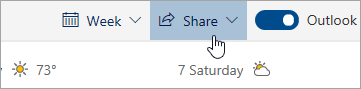

# Udostępnianie w aplikacji Outlook w sieci Web

Na pasku narzędzi Kalendarz u góry strony wybierz pozycję **Udostępnij**i wybierz kalendarz, który chcesz udostępnić.

    

**Uwaga:** Nie można udostępniać kalendarzy należących do innych osób.

- Wprowadź imię i nazwisko lub adres e-mail osoby, której kalendarz chcesz udostępnić.
- Wybierz sposób, w jaki dana osoba ma korzystać z kalendarza:
    - **Można wyświetlać, gdy jestem zajęty**   pozwala im zobaczyć, kiedy jesteś zajęty, ale nie zawiera szczegółów, takich jak lokalizacja wydarzenia.
    - **Może wyświetlać tytuły i lokalizacje**   pozwala im zobaczyć, kiedy jesteś zajęty, a także tytuł i lokalizację wydarzeń.
    - **Może wyświetlać wszystkie szczegóły**   pozwala im zobaczyć wszystkie szczegóły twoich wydarzeń.
    - **Można edytować**   pozwala im edytować kalendarz.
    - **Delegat**   pozwala im edytować kalendarz i udostępniać go innym osobom.
- Wybierz **pozycję Udostępnij**.
