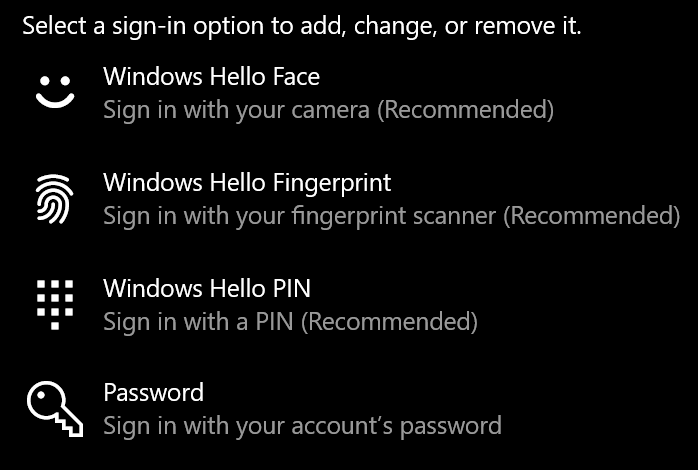
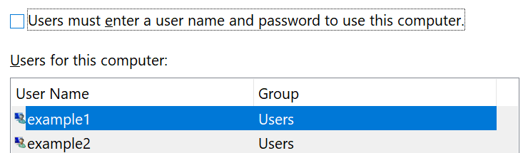

# Logowanie w celu Windows 10 bez użycia hasła

Aby uniknąć konieczności wpisywania hasła podczas Windows, zalecamy użycie jednej z opcji bezpiecznego logowania usługi Windows Hello, takich jak numer PIN, rozpoznawanie twarzy lub odcisk palca, jeśli są dostępne. Jeśli naprawdę chcesz wyłączyć bezpieczne logowanie, zobacz poniższe instrukcje "Automatyczne logowanie Windows 10 logowania".

**Zabezpieczanie Windows Hello alternatywnego hasła do konta**

Przejdź do **Ustawienia > Konta > opcje** logowania (lub kliknij [tutaj).](ms-settings:signinoptions?activationSource=GetHelp) Zostaną wyświetlone dostępne opcje logowania. Przykład:

Kliknij lub naciśnij jedną z opcji, aby ją skonfigurować. Przy następnym uruchomieniu lub Windows będzie można używać nowej opcji zamiast hasła. 

**Automatyczne logowanie się do Windows 10**

**Uwaga:** Automatyczne logowanie jest wygodne, ale wprowadza zagrożenie bezpieczeństwa, zwłaszcza jeśli Twój komputer jest dostępny dla wielu osób. 

1. Kliknij lub naciśnij przycisk **Start** na pasku zadań.

2. Wpisz **netplwiz** i naciśnij klawisz Enter, aby otworzyć okno Konta użytkowników.

3. W **ustawieniach** Konta użytkowników kliknij konto, na które chcesz automatycznie się zalogować Windows konta.

4. Wyczyść pole wyboru "Użytkownicy muszą wprowadzić nazwę użytkownika i hasło, aby korzystać z tego komputera".

    

5. Kliknij przycisk **OK**. Zostaniesz poproszony(-a) o wprowadzenie i potwierdzenie hasła wybranego konta. Kliknij **przycisk OK,** aby zakończyć. Po następnym Windows 10 się ono automatycznie zaloguje do wybranego konta.
