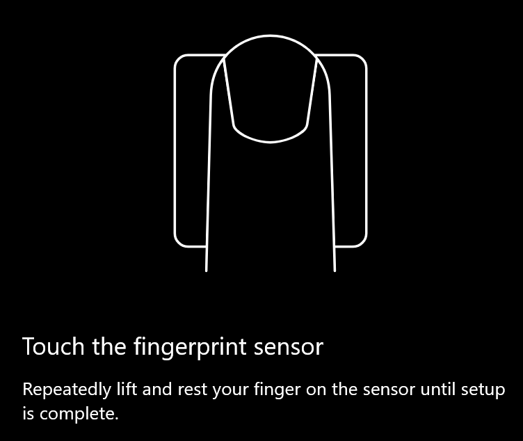

# Korzystanie z opcji odblokowywania za pomocą linii papilarnych w systemie Windows 10Use fingerprint unlock option in Windows 10

**Włącz funkcję Windows Hello Fingerprint****Enable Windows Hello Fingerprint**

Aby odblokować system Windows 10 przy użyciu linii papilarnych, musisz skonfigurować rozpoznawanie linii papilarnych przez dodanie co najmniej jednego palca (pozwalając systemowi Windows nauczyć się jego rozpoznawania).To unlock Windows 10 using your fingerprint, you need to set up Windows Hello Fingerprint by adding (letting Windows learn to recognize) at least one finger. 

1. Przejdź do **ustawień > Konta > opcje** logowania (lub kliknij [tutaj).](ms-settings:signinoptions?activationSource=GetHelp)Go to **Settings  > Accounts > Sign-in options** (or click [here](ms-settings:signinoptions?activationSource=GetHelp)). Zostaną wyświetlone dostępne opcje logowania.Available sign-in options will be listed. Przykład:For example:

    

2. Kliknij lub naciśnij pozycję **Linii papilarnych funkcji Windows Hello**, a następnie kliknij pozycję **Skonfiguruj**.Click or tap **Windows Hello Fingerprint**, then click **Set up**. W oknie konfiguracji funkcji Windows Hello kliknij pozycję **Wprowadzenie**.In the Windows Hello setup window, click **Get started**. Czujnik linii papilarnych zostanie aktywowany i zostaniesz poproszony o włodenie palca do czujnika:The fingerprint sensor will activate, and you'll be asked to place your finger on the sensor:

   

3. Postępuj zgodnie z instrukcjami, które będą zawierały prośbę o wielokrotne skanowanie palcem.Follow the instructions, which will ask you to repeatedly scan your finger. Po zakończeniu będziesz mieć możliwość dodawania innych palców, których możesz używać do logowania się.When this is finished, you'll have the option of adding other fingers you may want to use for sign-in. Następnym razem, gdy zalogujesz się do systemu Windows 10, będzie można użyć odcisku palca w tym celu.Next time you sign in to Windows 10, you will have the option of using your fingerprint to do so.

**Funkcja Windows Hello Fingerprint nie jest dostępna jako opcja logowania****Windows Hello Fingerprint not available as a sign-in option**

Jeśli funkcja Windows Hello Fingerprint nie jest wyświetlana jako opcja w opcjach **logowania,** oznacza to, że system Windows nie zna czytnika/skanera linii papilarnych dołączonych do komputera lub że zasady systemowe uniemożliwiają ich użycie (jeśli na przykład Twój komputer jest zarządzany przez Twoje miejsce pracy).If Windows Hello Fingerprint is not shown as an option in **Sign-in options**, it means Windows is not aware of any fingerprint reader/scanner attached to your PC, or that a system policy prevents its use (if for example your PC is managed by your workplace). Aby rozwiązać problemy:To troubleshoot: 

1. Wybierz przycisk **Start** na pasku zadań i wyszukaj menedżer **urządzeń**.Select the **Start** button in the Taskbar and search for **Device Manager**.

2. Kliknij lub naciśnij, aby **otworzyć Menedżera urządzeń.**Click or tap to open **Device Manager**.

3. W Menedżerze urządzeń rozwiń pozycję Biometryczne urządzenia, klikając jej link.In Device Manager, expand Biometric devices by clicking its chevron.

   

4. Twój skaner linii papilarnych powinien być wymieniony jako urządzenie biometryczne, takie jak skaner WBDItics:Your fingerprint scanner should be listed as a biometric device, such as the Synaptics WBDI scanner:

   

5. Jeśli twój skaner linii papilarnych nie jest widoczny, a skaner jest zintegrowany z komputerem, przejdź do witryny internetowej producenta komputera.If your fingerprint scanner is not shown, and the scanner is integrated into your PC, go to the PC manufacturer's website. W sekcji pomocy technicznej dotyczącej modelu komputera wyszukaj sterownik systemu Windows 10, który możesz zainstalować.In the technical support section for your PC model, search for a Windows 10 driver for a scanner that you can install.

6. Jeśli skaner jest oddzielony od komputera (podłączony przez USB), przejdź do witryny internetowej producenta skanera, aby znaleźć i zainstalować oprogramowanie sterownika urządzenia z systemem Windows 10 dla posiadaowego modelu skanera.If the scanner is separate from the PC (attached via USB), go to the scanner manufacturer's website to find and install Windows 10 device driver software for the scanner model you have.
