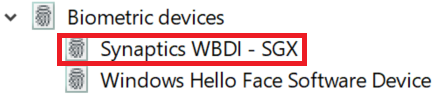

# Opcja odblokowywania linii papilarnych w Windows 10

**Włącz Windows Hello linii papilarnych**

Aby odblokować Windows 10 linii papilarnych, musisz skonfigurować odcisk w Windows Hello fingerprint przez dodanie (Windows naukę rozpoznawania) co najmniej jednego palca. 

1. Przejdź do **Ustawienia > Konta > opcje** logowania (lub kliknij [tutaj).](ms-settings:signinoptions?activationSource=GetHelp) Zostaną wyświetlone dostępne opcje logowania. Przykład:

    

2. Kliknij lub naciśnij przycisk **Windows Hello linii papilarnych,** a następnie kliknij **pozycję Skonfiguruj**. W Windows Hello konfiguracji kliknij pozycję **Wprowadzenie**. Czujnik linii papilarnych zostanie aktywowany i zostaniesz poproszony o włodenie palca do czujnika:

   

3. Postępuj zgodnie z instrukcjami, które będą zawierały prośbę o wielokrotne skanowanie palcem. Po zakończeniu będziesz mieć możliwość dodawania innych palców, których możesz używać do logowania się. Następnym razem, gdy zalogujesz się Windows 10 do aplikacji, będziesz mieć do tego możliwość użycia odcisku palca.

**Windows Hello Linie papilarne są niedostępne jako opcja logowania**

Jeśli opcja Windows Hello linii papilarnych linii papilarnych nie jest wyświetlana w opcjach **logowania,** oznacza Windows, że nie jest świadomy żadnych czytników linii papilarnych/skanera dołączonych do komputera lub że zasady systemowe uniemożliwiają ich użycie (jeśli na przykład Twój komputer jest zarządzany przez Twoje miejsce pracy). Aby rozwiązać problemy: 

1. Wybierz przycisk **Start** na pasku zadań i wyszukaj menedżer **urządzeń**.

2. Kliknij lub naciśnij, aby **otworzyć Menedżera urządzeń.**

3. W Menedżerze urządzeń rozwiń pozycję Biometryczne urządzenia, klikając jej link.

   

4. Twój skaner linii papilarnych powinien być wymieniony jako urządzenie biometryczne, takie jak skaner WBDItics:

   

5. Jeśli twój skaner linii papilarnych nie jest widoczny, a skaner jest zintegrowany z komputerem, przejdź do witryny internetowej producenta komputera. W sekcji pomocy technicznej dla swojego modelu komputera wyszukaj sterownik komputera Windows 10 skanera, który możesz zainstalować.

6. Jeśli skaner jest oddzielony od komputera (podłączonego przez USB), przejdź do witryny internetowej producenta skanera, aby znaleźć i zainstalować oprogramowanie sterownika urządzenia Windows 10 jego posiadany model.
