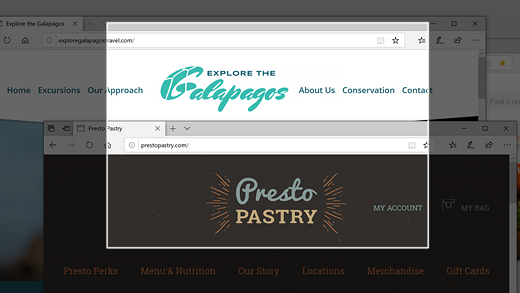
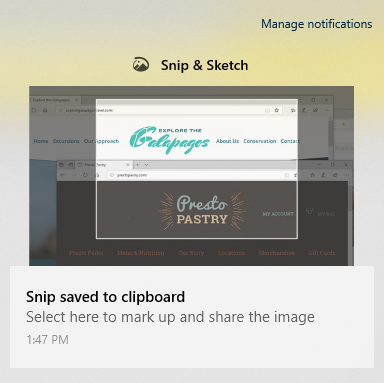

# Przechwytywanie, oznaczanie i udostępnianie & szkicu wycinka

Szkic ekranu nazywa się teraz **Wycinek & Szkic**. **Aby szybko zrobić wycinek:**

1. Naciśnij klawisz **Windows logo + Shift + S.** Ekran zostanie przyciemniony, a kursor będzie wyświetlany jako krzyżyk. 

2. Wybierz punkt na krawędzi obszaru, który chcesz skopiować, i kliknij kursor lewym przyciskiem myszy. 

3. Przesuń kursor, aby wyróżnić obszar, który chcesz przechwycić. Przechwycony obszar pojawi się na ekranie.

   

Wycięty obraz zostanie zapisany w Schowku i będzie gotowy do wklejania do wiadomości e-mail lub dokumentu. 

**Jeśli chcesz edytować lub wyświetlić obraz:** 

- Kliknij ikonę powiadomień po prawej stronie paska zadań. a następnie kliknij właśnie przechwycony obraz. Wycinek zostanie otwarty w aplikacji Wycinek & szkicu.

   
