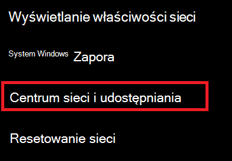
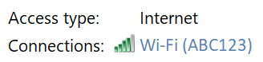
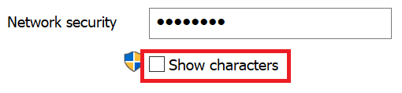

# Wyświetlanie hasła sieciowego sieci Wi-Fi w systemie Windows 10

1. Upewnij się, że Twój komputer z systemem Windows 10 jest podłączony do sieci Wi-Fi.

2. Przejdź do obszaru **ustawienia > sieci & Internet >** lub kliknij lub naciśnij tutaj, aby powiadomić nas o [tym](ms-settings:network?activationSource=GetHelp) .

3. Kliknij pozycję **Centrum sieci i udostępniania**.

    

4. W **Centrum sieci i udostępniania**obok pozycji **połączenia**zostanie wyświetlona nazwa Twojej sieci bezprzewodowej. Jeśli na przykład Twoja sieć ma nazwę "ABC123", być może zobaczysz:

    

    Kliknij nazwę sieci bezprzewodowej, aby otworzyć okno statusu sieci Wi-Fi. 

5. W oknie stan sieci Wi-Fi kliknij pozycję **właściwości sieci bezprzewodowej**, kliknij kartę **zabezpieczenia** , a następnie zaznacz pole wyboru **Pokaż znaki**.

    

